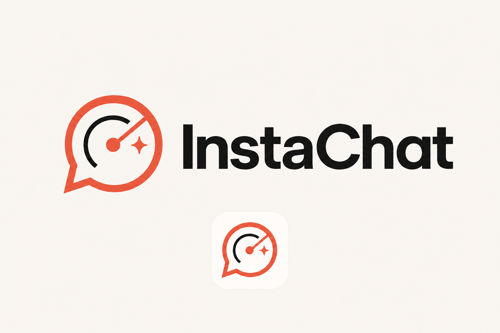
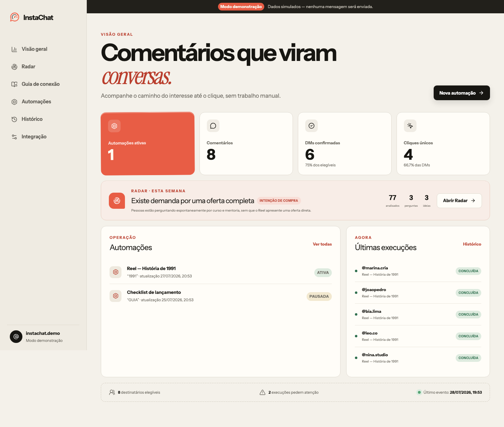

<p align="center">
  
</p>

<p align="center">
  Automação oficial para comentários do Instagram e inteligência de audiência para Reels.
</p>

<p align="center">
  <a href="https://github.com/hcb2019/instachat/actions/workflows/ci.yml"></a>
  <a href="https://github.com/hcb2019/instachat/security/code-scanning"></a>
  <a href="LICENSE"></a>
  
</p>

> Projeto independente, não afiliado, patrocinado ou endossado pela Meta ou pelo Instagram. Use somente a API oficial e respeite os termos da plataforma.



## O que o InstaChat faz

- identifica palavras-chave e variações em comentários de Reels;
- alterna respostas públicas para evitar aparência robótica;
- envia a resposta privada permitida pela API, com link rastreável;
- pode liberar o conteúdo após confirmação de seguidor;
- mostra histórico, falhas e métricas;
- analisa comentários no Radar e sugere temas, oportunidades e ideias;
- cria no Estúdio um pacote conectado de hook, legenda formatada, automação e um material público guiado, com primeira ação explícita, campos de trabalho salvos no navegador, critérios de conclusão, exemplos preenchidos e plano final copiável;
- copia textos prontos para o Instagram preservando parágrafos e linhas em branco;
- funciona em modo demonstração sem credenciais;
- mantém envio e ativação sob aprovação humana.

Stack: Next.js 16, React 19, TypeScript, Supabase, Instagram API with Instagram Login, OpenAI opcional, Vitest e Playwright.

## Teste em cinco minutos

Requisitos: Node.js 24 e pnpm 11.

```bash
git clone https://github.com/hcb2019/instachat.git
cd instachat
corepack enable
pnpm install --frozen-lockfile
cp .env.example .env.local
pnpm config:check
pnpm dev
```

Abra <http://localhost:3000>. O modo demonstração não chama Supabase, Meta ou OpenAI.

Com Docker:

```bash
cp .env.example .env.local
docker compose --env-file .env.local up --build
```

## Instalação real

Escolha uma opção:

- [Vercel + Supabase, recomendado](docs/deployment.md);
- [computador local ou VPS com Docker](docs/self-hosting.md);
- [configuração completa da Meta](docs/meta-setup.md);
- guia visual em `/connection-guide` depois de iniciar o aplicativo.

Nunca copie credenciais de outra instalação. Cada pessoa precisa criar seu próprio Supabase, aplicativo Meta e segredos.

## Variáveis e segurança

Use `.env.example` apenas como modelo. `.env.local` é ignorado pelo Git.

```bash
openssl rand -base64 32 # TOKEN_ENCRYPTION_KEY
openssl rand -hex 32    # WORKER_SECRET
openssl rand -hex 32    # CRON_SECRET (Vercel)
openssl rand -hex 32    # META_WEBHOOK_VERIFY_TOKEN
pnpm config:check
```

Controles principais:

- owner-only por magic link e `OWNER_EMAIL`;
- RLS por `owner_id`;
- OAuth com `state` de uso único;
- webhook HMAC sobre o corpo bruto;
- token Meta cifrado com AES-256-GCM;
- troca automática do token inicial pelo token de longa duração e renovação preventiva;
- links opacos armazenados somente como hash;
- CSP, HSTS, `no-store` e bloqueio de framing;
- validação Zod e erros sanitizados;
- dados pessoais com retenção limitada;
- CodeQL, Dependabot e CI em Pull Requests.

Leia [SECURITY.md](SECURITY.md), o [modelo de ameaças](instachat-threat-model.md) e o [relatório de segurança](security_best_practices_report.md).

## Desenvolvimento

```bash
pnpm lint
pnpm typecheck
pnpm test
pnpm build
pnpm exec playwright install chromium
pnpm test:e2e
```

Supabase local:

```bash
pnpm db:start
pnpm db:reset
pnpm db:types
```

## Como colaborar

- Ideias e erros: abra uma Issue.
- Código: faça um Fork e envie um Pull Request.
- Vulnerabilidades: use um relato privado na aba Security.

Veja [CONTRIBUTING.md](CONTRIBUTING.md), o [Código de Conduta](CODE_OF_CONDUCT.md) e o [guia do GitHub para iniciantes](docs/github-for-beginners.md).

Contribuições não alteram `main` automaticamente. O mantenedor revisa e decide o que será incorporado.

## Licença

Distribuído sob a [Licença MIT](LICENSE). Você pode usar, modificar e redistribuir o código mantendo o aviso de copyright e a licença.
