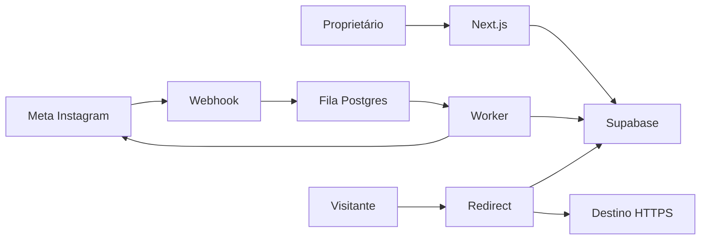

# Threat model — InstaChat

## Executive summary

Os maiores riscos são roubo do token Meta, falsificação/reentrega de webhooks e duplicação de mensagens. O desenho reduz esses riscos cifrando tokens, verificando HMAC sobre o corpo bruto e impondo idempotência tanto no evento quanto no run.

## Scope and assumptions

- Em escopo: aplicação Next.js, Supabase, filas, OAuth Meta, webhook, redirecionador público e análise de audiência pela OpenAI.
- Produção presumida em Vercel/Supabase, exposta à internet, com um proprietário e uma conta profissional.
- Comentários e identificadores Instagram-scoped são dados pessoais de sensibilidade moderada; tokens e segredos são de alta sensibilidade.
- CI, fixtures e Supabase local não são produção. SaaS multiusuário, pagamentos e Advanced Access estão fora do escopo.
- O plano aprovado pelo proprietário valida uso pessoal, baixa escala inicial e autenticação owner-only. Uma abertura a terceiros exige nova análise.

## System model

### Primary components

- Navegador autenticado e Server Actions: painel e CRUD (`src/app/(app)`, `src/features/automations/actions.ts`).
- Entradas públicas: OAuth, webhook Meta e redirect de clique (`src/app/api/meta`, `src/app/r`).
- Processador e adaptador Meta (`src/server/jobs.ts`, `src/server/instagram`).
- Supabase Auth/Postgres/pgmq com schema e RLS versionados (`supabase/migrations`).

### Data flows and trust boundaries

- Proprietário → Next.js: cookies Supabase, formulários e ações; sessão server-side, Origin e Zod.
- Meta → webhook: JSON por HTTPS; HMAC no corpo bruto, schema Zod, limite de 256 KB.
- Next.js → Supabase: HTTPS com chave publicável autenticada ou secret key server-only; RLS e funções restritas.
- Worker → Meta: HTTPS com token decifrado somente em memória e destinos fixos `graph.instagram.com`.
- Worker de audiência → OpenAI: comentários sem usernames/IDs, aliases efêmeros, Structured Outputs e `store: false`.
- Visitante → redirecionador: token opaco; hash no banco, GET único e destino HTTPS capturado no run.

#### Diagram

## Assets and security objectives

| Asset | Why it matters | Security objective |
|---|---|---|
| Token Meta e segredos | Permitem atuar como a conta profissional | C/I |
| Regras de automação | Controlam mensagens públicas e privadas | I |
| Runs e métricas | Evidência operacional e prevenção de duplicidade | I/A |
| Comentários e IGSIDs | Dados pessoais necessários ao fluxo | C/I |
| Insights e prompts | Influenciam decisões editoriais e comerciais | I/C |
| Fila e worker | Garantem entrega sem repetição | I/A |

## Attacker model

### Capabilities

- Enviar requisições arbitrárias às rotas públicas, comentar nos Reels e reutilizar payloads observados.
- Induzir conteúdo malicioso em comentário/username e visitar links rastreados repetidamente.
- Tentar CSRF, força bruta de tokens, abuso de recursos e exploração de dependências públicas.

### Non-capabilities

- Não possui inicialmente cookies do proprietário, segredos Vercel/Supabase, App Secret Meta ou acesso ao banco.
- Não controla DNS/TLS dos provedores assumidos nem executa código no servidor sem outra vulnerabilidade.

## Entry points and attack surfaces

| Surface | How reached | Trust boundary | Notes | Evidence |
|---|---|---|---|---|
| Webhook | GET/POST público | Meta → app | Corpo bruto, HMAC, Zod, size limit | `src/app/api/meta/webhook/route.ts` |
| OAuth | GET/callback | Browser/Meta → app | Owner, state cookie HttpOnly | `src/app/api/meta/oauth` |
| Worker | POST público | Cron → app | Bearer comparado em tempo constante | `src/app/api/internal/jobs/process/route.ts` |
| Redirect | GET público | Internet → app/DB | Token de 128 bits, hash e HTTPS | `src/app/r/[token]/route.ts` |
| Server Actions | POST framework | Owner → app | Auth, RLS, validação runtime | `src/features/automations/actions.ts` |
| Worker de audiência | POST público / fila | Cron → app → OpenAI | Bearer, limites diários, aliases e schema estrito | `src/app/api/internal/jobs/analyze/route.ts` |

## Top abuse paths

1. Atacante falsifica webhook → falha no HMAC → evento rejeitado antes do parse.
2. Meta reentrega comentário → unique de conta/comentário → nenhuma segunda mensagem entra na fila.
3. Mesmo usuário comenta novamente → unique automação/IGSID → run duplicado não é criado.
4. Atacante tenta adivinhar link → precisa acertar 128 bits → token inválido retorna 404 sem revelar destino.
5. XSS tenta roubar token Meta → token nunca chega ao navegador e CSP limita scripts.
6. Timeout Meta deixa resultado incerto → run `ambiguous` → nenhuma repetição automática cega.
7. Comentário tenta instruir a IA → é tratado como dado dentro de JSON → schema fechado, evidências e aprovação humana limitam o impacto.

## Threat model table

| Threat ID | Threat source | Prerequisites | Threat action | Impact | Impacted assets | Existing controls (evidence) | Gaps | Recommended mitigations | Detection ideas | Likelihood | Impact severity | Priority |
|---|---|---|---|---|---|---|---|---|---|---|---|---|
| TM-001 | Remoto | Descobrir endpoint | Forjar comentários | Spam e ações não autorizadas | Conta, fila | HMAC raw body e schema em `src/app/api/meta/webhook/route.ts` | Rotação do App Secret é manual | Alertar assinaturas inválidas e rotacionar segredo | Contagem de 401 por origem | baixa | alta | média |
| TM-002 | XSS/insider | Executar código ou ler ambiente | Exfiltrar token Meta | Controle da conta profissional | Token Meta | AES-GCM em `src/server/crypto.ts`; server-only | Chave única sem KMS | Rotação documentada e KMS quando SaaS | Alertar uso Meta anômalo | baixa | alta | alta |
| TM-003 | Reentrega/concorrência | Payload válido repetido | Enviar DM duplicada | Spam/bloqueio Meta | Runs, reputação | Constraints e fila em migration; lógica em `src/server/jobs.ts` | Timeout pode ficar ambíguo | Reconciliação manual antes de retry | Métrica de unique conflicts/ambiguous | média | alta | alta |
| TM-004 | Internet | Obter ou adivinhar link | Inflar cliques/acessar destino | Métrica imprecisa | Métricas | Token 128-bit e hash em `src/server/crypto.ts`; primeiro clique atômico | Scanners podem contar GET | Classificar bots se volume justificar | Taxa anormal por user-agent | média | média | média |
| TM-005 | Usuário autenticado comprometido | Roubar sessão owner | Alterar automações | Mensagens maliciosas | Regras, conta | Supabase SSR, owner allowlist e RLS | Sem MFA no MVP | Ativar MFA/passkey antes de expansão | Auditoria de mudanças | baixa | alta | alta |
| TM-006 | Autor de comentário | Inserir prompt injection ou conteúdo enganoso | Manipular insights | Decisão editorial ruim | Insights, reputação | Comentários em JSON, prompt de sistema, Structured Outputs, evidência rastreável e aprovação humana | Modelos podem interpretar instruções em dados | Monitorar feedback não útil e revisar prompt no piloto | Picos de descarte/feedback negativo | média | média | média |
| TM-007 | Erro de integração/fornecedor | Enviar PII desnecessária à IA | Exposição de dados pessoais | Comentários e identidades | Anonimização com aliases em `src/lib/audience.ts`, `store: false`, limites de retenção | Texto livre pode conter PII declarada pelo próprio autor | Redação semântica adicional antes de expansão | Auditoria amostral sem persistir prompts | baixa | alta | alta |
| TM-008 | Usuário/robô | Disparar análises repetidas | Custo e indisponibilidade | Orçamento, fila | Owner auth, fingerprint, duas análises/dia, 2.000 comentários/run | Cap diário depende de consulta transacional no MVP owner-only | Advisory lock/constraint ao abrir para multiusuário | Alertas por tokens/duração | baixa | média | média |

## Criticality calibration

- Crítica: vazamento público de segredos ou bypass completo de autenticação com envio em massa.
- Alta: roubo direcionado do token, DM duplicada sistemática ou alteração não autorizada de automações.
- Média: inflação de métricas, DoS recuperável da fila ou exposição limitada de comentários.
- Baixa: informação operacional sem PII ou falha ruidosa sem efeito persistente.

## Focus paths for security review

| Path | Why it matters | Related Threat IDs |
|---|---|---|
| `src/app/api/meta/webhook/route.ts` | Entrada pública de eventos | TM-001, TM-003 |
| `src/server/jobs.ts` | Idempotência e chamadas com efeito externo | TM-002, TM-003 |
| `src/server/crypto.ts` | Proteção de tokens e links | TM-002, TM-004 |
| `src/app/api/meta/oauth` | Vincula a conta privilegiada | TM-002, TM-005 |
| `supabase/migrations` | RLS, grants, fila e constraints | TM-003, TM-005 |
| `src/features/automations/actions.ts` | Mutações autenticadas | TM-005 |
| `src/server/audience` | Anonimização, custo e interpretação de conteúdo hostil | TM-006, TM-007, TM-008 |
| `src/features/audience/actions.ts` | Feedback e criação de rascunhos | TM-005, TM-006 |

## Quality check

- Entradas públicas, painel, fila, banco e integração Meta cobertos.
- Cada fronteira aparece em pelo menos uma ameaça.
- Runtime está separado de CI, fixtures e desenvolvimento local.
- Premissas de uso pessoal, owner-only e baixa escala vieram do PRD/plano aprovado.
- Reavaliar antes de multi-tenancy, Advanced Access, pagamentos ou volume elevado.
